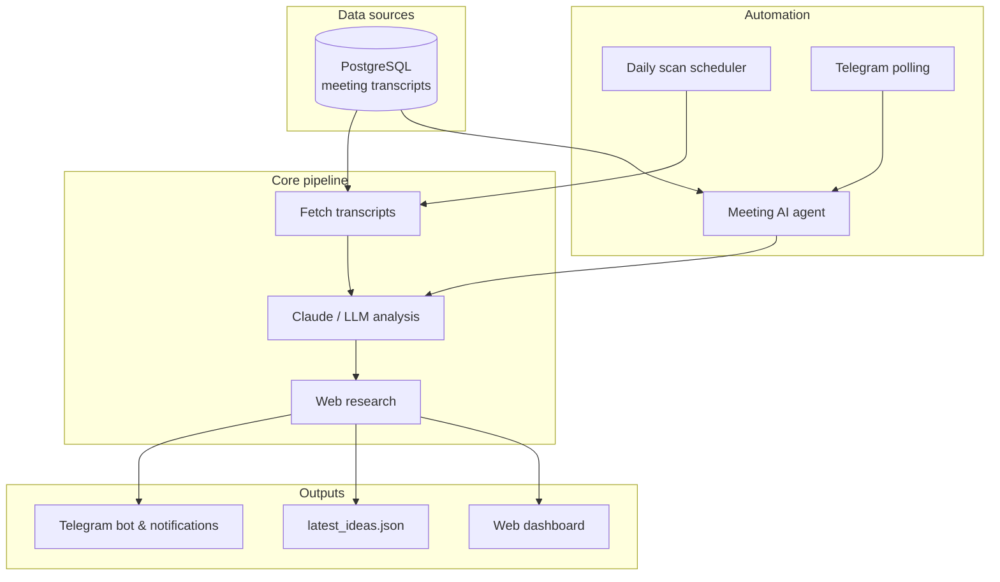

# Glasshouse — Local Meeting Intelligence

**Turn government meeting transcripts into video story ideas, research briefs, and Telegram alerts.**

Glasshouse connects to a PostgreSQL database of YouTube meeting transcripts, uses Claude (or OpenAI/OpenRouter) to identify newsworthy stories, enriches ideas with web research, and delivers results through a web dashboard and a conversational Telegram bot.

Built for **local news producers**, **citizen journalists**, and **YouTube creators** covering city council, school board, county commission, and other public meetings.

---

## What it does

| Feature | Description |
|---------|-------------|
| **Video idea generation** | Claude analyzes transcripts and returns titles, hooks, angles, key points, and research queries |
| **Background research** | DuckDuckGo search enriches each idea with real-world context |
| **Web dashboard** | Test connections, tune AI guidance, preview ideas in the browser |
| **Daily automation** | Scans for new meetings once per day and notifies you on Telegram |
| **Telegram AI agent** | Ask questions about the latest meeting in natural language |
| **Producer guidance** | Save tone, audience, and topic preferences — persisted in Postgres |

---

## Architecture



See [docs/ARCHITECTURE.md](docs/ARCHITECTURE.md) for a file-by-file code map.

---

## Quick start

### Prerequisites

- Python 3.11+
- PostgreSQL with meeting transcripts (or use included Docker setup for local dev)
- At least one LLM API key (Anthropic, OpenRouter, or OpenAI)
- Telegram bot token (optional, for notifications)

### 1. Clone and install

```bash
git clone https://github.com/TheMitchyBoy/Glasshouse.git
cd Glasshouse
pip install -r requirements.txt
```

### 2. Configure environment

```bash
cp .env.example .env
# Edit .env with your DATABASE_URL, API keys, and Telegram credentials
```

### 3. Start PostgreSQL (local dev only)

```bash
docker compose up -d
```

This loads `db/schema.sql` and sample meeting data from `db/seed.sql`.

### 4. Run the dashboard (recommended)

```bash
python run_dashboard.py
```

Open [http://localhost:8080](http://localhost:8080)

The dashboard starts the daily scheduler and Telegram bot automatically.

### 5. Or run the CLI pipeline once

```bash
python run_pipeline.py          # analyze + send Telegram
python run_pipeline.py --dry-run  # preview only, no Telegram
```

---

## Environment variables

### Required

| Variable | Description |
|----------|-------------|
| `DATABASE_URL` | PostgreSQL connection string for your YouTube transcript database |

### LLM (at least one required)

| Variable | Description |
|----------|-------------|
| `ANTHROPIC_API_KEY` | Direct Claude API key (preferred) |
| `OPENROUTER_API_KEY` | Claude via [OpenRouter](https://openrouter.ai) |
| `OPENAI_API_KEY` | Fallback provider |
| `CLAUDE_MODEL` | Default: `claude-sonnet-4-5` |

### Telegram

| Variable | Description |
|----------|-------------|
| `TELEGRAM_BOT_TOKEN` | From [@BotFather](https://t.me/BotFather) |
| `TELEGRAM_CHAT_ID` | Your chat or group ID (only this chat can use the bot) |

### Pipeline tuning

| Variable | Default | Description |
|----------|---------|-------------|
| `LOOKBACK_DAYS` | `14` | How far back to fetch meetings |
| `MAX_TRANSCRIPTS` | `10` | Max transcripts per analysis run |
| `MAX_TRANSCRIPT_CHARS` | `6000` | Characters sent to LLM per transcript |
| `LLM_MAX_TOKENS` | `8192` | Max tokens in LLM response |
| `MAX_RESEARCH_QUERIES` | `3` | Web searches per idea |

### Automation

| Variable | Default | Description |
|----------|---------|-------------|
| `DAILY_SCAN_ENABLED` | `true` | Run daily scan for new meetings |
| `DAILY_SCAN_HOUR` | `8` | Hour to scan (24h clock) |
| `DAILY_SCAN_MINUTE` | `0` | Minute to scan |
| `DAILY_SCAN_TIMEZONE` | `UTC` | Timezone, e.g. `America/New_York` |
| `TELEGRAM_POLLING_ENABLED` | `true` | Listen for Telegram messages |
| `AGENT_MAX_HISTORY` | `8` | Conversation turns remembered by Telegram agent |

---

## Telegram bot

Message your bot from the configured `TELEGRAM_CHAT_ID`.

### Commands

| Command | What it does |
|---------|--------------|
| `/latest` `/ideas` | Full structured video-ideas analysis for the latest meeting |
| `/reset` | Clear conversation memory |
| `/help` | Show available commands |
| `/status` | Confirm the bot is running |

### Natural language (AI agent)

Ask anything about the latest meeting — the bot uses transcripts and saved analysis as context:

- *What was the most controversial vote?*
- *Summarize the school board budget discussion*
- *Give me 3 video angles on the housing item*
- *Who spoke against the bond measure?*

---

## Daily automation

When the dashboard is running, Glasshouse:

1. **Scans daily** for meeting transcripts not yet in `processed_transcripts`
2. **Runs analysis** and **sends Telegram** when new meetings are found
3. **Polls Telegram** for questions and on-demand requests

Manual trigger:

```bash
python run_daily_scan.py
curl -X POST http://localhost:8080/api/scan/daily
```

---

## API reference

| Endpoint | Method | Description |
|----------|--------|-------------|
| `/api/health` | GET | Health check for Railway/deploy |
| `/api/status` | GET | Database, LLM, Telegram, automation status |
| `/api/guidance` | GET/PUT | Read or save AI producer guidance |
| `/api/telegram/test` | POST | Send a Telegram test message |
| `/api/analyze` | POST | Run analysis from the dashboard |
| `/api/analyze/latest` | POST | Analyze only the latest meeting |
| `/api/scan/daily` | POST | Trigger daily new-meeting scan |
| `/api/ideas/latest` | GET | Return last analysis JSON |

---

## Database

Glasshouse adapts to different Postgres schemas automatically. It expects a `transcripts` table and optionally a `videos` table.

### Core tables

| Table | Purpose |
|-------|---------|
| `transcripts` | Meeting transcript text |
| `videos` | Video metadata (`is_meeting = TRUE` for meetings) |
| `analysis_runs` | History of each analysis execution |
| `processed_transcripts` | Tracks which meetings were already analyzed (daily scan) |
| `app_settings` | Saved producer guidance (survives redeploys) |

### Add a meeting manually

```sql
INSERT INTO videos (video_id, title, is_meeting, meeting_type, published_at)
VALUES ('abc123', 'County Commissioners - Jan 2025', TRUE, 'county_commission', NOW());

INSERT INTO transcripts (video_id, full_text)
VALUES (
  (SELECT id FROM videos WHERE video_id = 'abc123'),
  'Full transcript text here...'
);
```

---

## Deploy on Railway

1. Connect this repo to Railway
2. Set environment variables from `.env.example`
3. Ensure start command is:

```bash
uvicorn src.api.app:app --host 0.0.0.0 --port $PORT
```

4. Health check path: `/api/health`
5. The app binds to Railway's `PORT` automatically

**Do not** use `run_pipeline.py` as the start command — it exits immediately and won't serve HTTP.

---

## Project layout

```
Glasshouse/
├── run_dashboard.py       # Start web UI + scheduler + Telegram bot
├── run_pipeline.py        # One-shot CLI analysis
├── run_daily_scan.py      # Manual daily scan trigger
├── config/
│   └── ai_guidance.json   # Default guidance (Postgres is canonical store)
├── db/
│   ├── schema.sql         # Full database schema
│   ├── seed.sql           # Sample meetings for local dev
│   └── migrations/        # Incremental schema changes
├── docs/
│   └── ARCHITECTURE.md    # Code map and data flow
├── frontend/              # Dashboard HTML/CSS/JS
└── src/
    ├── api/               # FastAPI app and REST routes
    ├── config.py          # Environment settings
    ├── db/                # Postgres queries and schema detection
    ├── llm/               # Claude analysis, chat, JSON parsing
    ├── notifications/     # Telegram send/format helpers
    ├── research/          # DuckDuckGo background research
    └── services/          # Pipeline, scheduler, agent, bot
```

---

## Troubleshooting

| Problem | Likely cause | Fix |
|---------|--------------|-----|
| `Application failed to respond` on Railway | Wrong port | App must use `$PORT`; see `railway.toml` |
| `column v.video_id does not exist` | Schema mismatch | Auto-detected — pull latest `main` |
| `All LLM providers failed: HTTP 404` | Wrong model name | Set `CLAUDE_MODEL=claude-sonnet-4-5` |
| `Unterminated string` JSON error | Response too long | Lower `MAX_TRANSCRIPTS` or `MAX_TRANSCRIPT_CHARS` |
| Guidance not saving on Railway | File storage is ephemeral | Uses Postgres `app_settings` — ensure DB is connected |
| Telegram bot not responding | Polling disabled or wrong chat ID | Set `TELEGRAM_POLLING_ENABLED=true` and verify `TELEGRAM_CHAT_ID` |

---

## License

MIT — use freely for local news and civic media projects.
